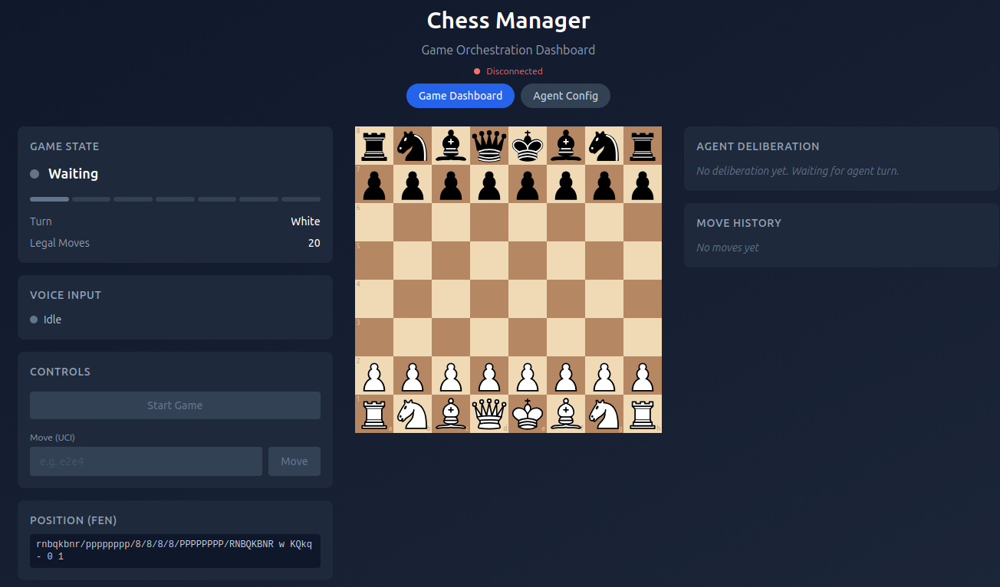
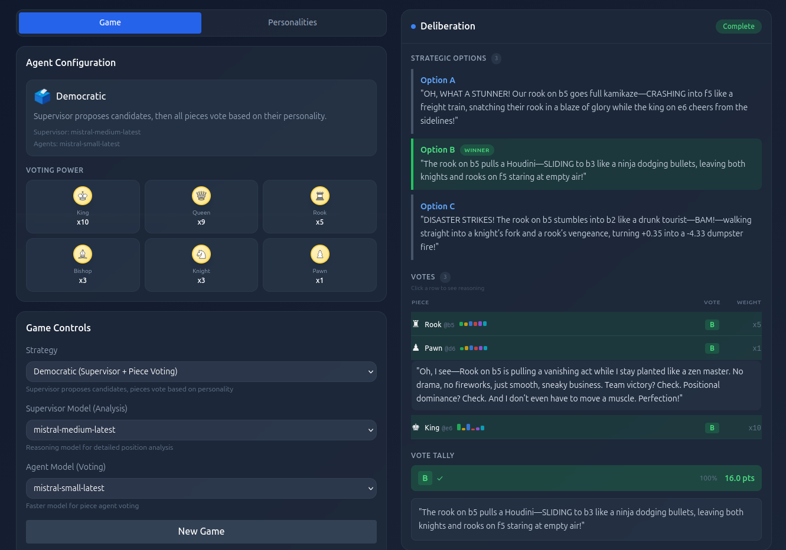
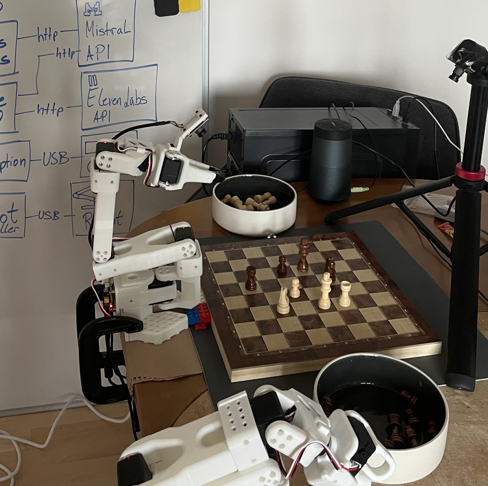
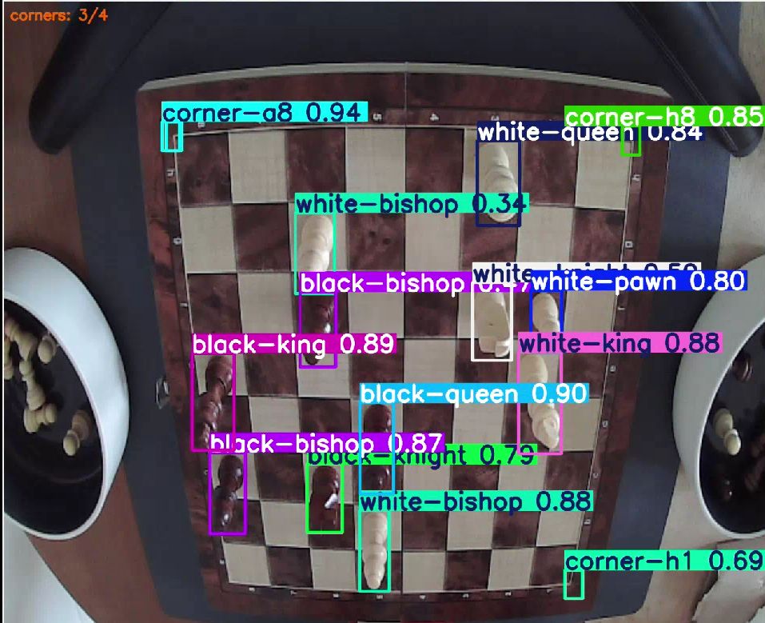

# Autonomous Chess Robot

Created for the Mistral AI Hackathon 2026 by Stefan Bühler, Mark Schutera, and Jannick Lippert.

A human plays physical chess against a team of AI-powered chess piece agents. A robotic arm executes moves on a real board, LLM agents deliberate and vote on strategy, computer vision detects the board state, and the system narrates the game with distinct character voices. ElevenLabs powers both text-to-speech — giving each chess piece its own voice — and realtime speech-to-text for hands-free move input. Various Mistral AI models handle a wide range of creative and administrative tasks throughout the system, from agent deliberation and move voting to parsing spoken moves, generating theatrical game commentary, and supervisor-level position analysis. A central orchestrator ties everything together through a state machine, with a live web dashboard showing the game in real time.

## Architecture

```
                        Human
              voice / CLI / physical board
                          │
                          │ spoken moves, typed UCI, piece movements
                          ▼
┌───────────────────────────────────────────────────────────────────┐
│                                                                   │
│              chess_manager (AI-Powered Orchestrator)              │
│                                                                   │
│   Game state, move validation, voice I/O, teacher commentary      │
│                                                                   │
└───────┬───────────────────┬───────────────────┬───────────────────┘
        │                   │                   │
        │ MoveCommand       │ FEN + strategy    │ capture trigger
        │ (piece, square,   │                   │
        │  capture flags)   │                   │
        ▼                   ▼                   ▼
┌───────────────┐  ┌─────────────────┐  ┌───────────────────┐
│   So101Chess  │  │ animated-knight │  │   venividivici    │
│     Bot       │  │                 │  │                   │
│  6-DOF Robot  │  │  Multi-Agent    │  │  YOLOv8 Chess     │
│  Arm Control  │  │  LLM System     │  │  Piece Detection  │
└───────┬───────┘  └────────┬────────┘  └─────────┬─────────┘
        │                   │                     │
        │ success/error,    │ selected move,      │ FEN, piece
        │ execution time    │ agent opinions,     │ positions,
        │                   │ voting summary      │ confidence
        ▼                   ▼                     ▼
┌───────────────────────────────────────────────────────────────────┐
│                                                                   │
│              chess_manager (AI-Powered Orchestrator)              │
│                                                                   │
├───────────────────────┬───────────────────────────────────────────┤
│   React Dashboard     │              ROS2 / chess_msgs            │
│   (WebSocket)         │    BoardState, MoveCommand, MoveResult,   │
│                       │    AgentRequest, AgentOpinions            │
└───────────────────────┴───────────────────────────────────────────┘
```

### ROS2 Communication Layer

All inter-component communication flows through ROS2 topics using custom message types defined in the `chess_msgs` package. Because the subsystems run in incompatible Python environments (system Python for ROS2, conda for ML/robotics libraries), TCP socket bridges translate between ROS2 topics and JSON-over-TCP.

## Modules

### chess_manager — AI-Powered Orchestrator

The Chess Manager owns the authoritative game state and runs a 7-state async state machine that drives the full game loop: waiting for the human to move, validating the move, requesting an AI response from the agents, and commanding the robot arm to execute the chosen move on the physical board. Human moves can arrive from three sources — a CLI text interface, voice input via ElevenLabs realtime speech-to-text with Mistral-powered natural language move parsing, or a computer vision capture that diffs the detected board state against the known position to infer which move was made.

A built-in chess teacher runs Stockfish analysis in the background after every human move and uses Mistral to generate witty sports-broadcaster-style commentary, which is spoken aloud through ElevenLabs TTS. Each chess piece type is mapped to a distinct ElevenLabs voice with its own character — the King speaks with a deep commanding tone, the Queen is assertive, the Knight energetic — bringing the agent deliberation to life as pieces explain their reasoning out loud. A React dashboard connects via WebSocket and mirrors the game in real time, showing the board, state pipeline, animated SVG piece avatars with speaking mouth animations, agent deliberation results, and move history.



**Submodules:**
- `state_manager.py` — Core state machine and async game loop with move validation and perception diffing
- `chess_teacher.py` — Stockfish position analysis + Mistral commentary generation + TTS playback
- `voice/chess_stt.py` — ElevenLabs realtime STT with Mistral structured-output move parsing
- `voice/chess_tts.py` — ElevenLabs streaming TTS with per-piece voice mapping
- `frontend/` — React dashboard with ChessBoard, StateIndicator, DeliberationPanel, PieceAvatar, and GameControls

---

### animated-knight — Multi-Agent LLM Chess System

The animated-knight system implements a multi-agent architecture where every chess piece on the board is backed by its own LLM agent with a distinct personality, and agents collectively deliberate and vote on which move to play. Each piece agent carries six weighted personality traits — self-preservation, personal glory, team victory, aggression, positional dominance, and cooperation — that are injected into its prompts as natural language descriptions and percentage-weighted evaluation criteria, shaping how the agent reasons about candidate moves without any model fine-tuning. The piece's value determines its voting weight (pawn=1, knight/bishop=3, rook=5, queen=9, king=10), so higher-value pieces have more influence on the final decision.

Three decision strategies are available. The Democratic strategy has each movable piece propose its own best move, then all pieces vote on the proposals with piece-value weighting. The Supervisor strategy uses a higher-level coordinator agent that analyzes the position — optionally assisted by Stockfish for the top-3 engine moves — and makes the final call after reading all proposals. The Hybrid strategy, which is the default, cleanly separates analysis from preference: the supervisor produces three descriptive candidate options with per-piece impact assessments, and every piece votes on prose descriptions rather than chess notation, forcing personality-driven reasoning. The LLM provider layer abstracts over Mistral, OpenAI, and Anthropic, allowing a larger model for supervisor analysis and a smaller model for the up-to-16 parallel agent voting calls. The entire deliberation pipeline streams end-to-end, enabling the React frontend to show agent thoughts, proposals, votes with personality bar charts, and animated vote tallies appearing in real time.



**Submodules:**
- `backend/agents/` — Per-piece LLM agents with personality-driven proposal and voting, supervisor agent with optional Stockfish analysis
- `backend/agents/strategies/` — Democratic, Supervisor, and Hybrid decision strategies
- `backend/agents/personality.py` — Six-trait personality system with named presets and runtime editing
- `backend/llm/` — LLM provider abstraction over Mistral, OpenAI, Anthropic with streaming support
- `backend/orchestration/` — Game session management, model switching, and move generation
- `backend/chess_engine/` — python-chess wrapper, move validation, and Stockfish engine analysis
- `backend/api/` — REST and WebSocket API for game management and streaming deliberation
- `frontend/` — React UI with ChessBoard, DeliberationView, PersonalityEditor, and real-time vote visualization

---

### So101ChessBot — Robotic Arm Control

The So101ChessBot module controls a SO101 6-DOF robotic arm to physically move chess pieces on a real board. The arm uses STS3215 servo motors across six joints commanded at 50 Hz through the LeRobot hardware driver. An inverse kinematics controller built on Pinocchio and Pink provides Cartesian end-effector positioning with a two-phase fallback strategy: when a constrained solve with both position and orientation fails near the reachability boundary, it first solves for a raised approach position, then re-solves for the final target without the orientation constraint, letting the wrist extend naturally to reach it.

Board knowledge comes from a joint-angle lookup table calibrated by physically teleoperating the arm above each of all 64 squares and recording the joint configuration, rather than computing positions analytically from board geometry. Pick-and-place motions are executed by replaying pre-recorded human demonstrations from a LeRobot dataset — separate pick and place episodes exist for each square, keyed by piece type — because the descent, grasp, and lift trajectories depend on piece geometry and are difficult to parameterize analytically. The move execution system handles normal moves, captures with graveyard placement for removed pieces, en passant, castling with sequential king-then-rook movements, and pawn promotion.



**Submodules:**
- `lerobot_chess_bot/so101_ik.py` — Thread-safe IK controller with Pinocchio/Pink solver and 50 Hz observation loop
- `lerobot_chess_bot/chess_board.py` — Joint-angle lookup table with teleoperation-based calibration for all 64 squares
- `lerobot_chess_bot/chess_mover.py` — Demo-replay pick-and-place with graveyard handling and special move logic (castling, en passant, promotion)
- `ros_bridge.py` — ROS2 bridge node forwarding move commands and joint states between ROS2 topics and the robot controller
- `robot/` — URDF model and STL meshes for the SO101 arm

---

### venividivici — Chess Piece Detection

The venividivici module provides YOLOv8-based chess piece detection that takes a photo of a physical chess board and produces a FEN string describing the position. The model detects 16 classes in a single pass: 12 piece types (white and black variants of pawn, rook, knight, bishop, queen, and king) plus 4 board corner markers at a8, h8, h1, and a1. These corner markers are the key innovation for board localization — the model learns to detect the four anchor points needed to compute a perspective homography, eliminating any separate calibration step at inference time and making the system robust to arbitrary camera angles.

The training pipeline requires only a handful of real photos per board. An interactive annotation tool records the four board corners in empty board images, from which all 64 square centers are derived via perspective transform. Piece crops are annotated with polygon masks to preserve their shape under perspective distortion. A synthetic data generator then composites these RGBA piece crops onto empty board photos with random augmentations — affine transforms, flips, blur, shear, jitter, and rotation — producing unlimited YOLO-format training data. Training itself uses online synthetic generation: a custom PyTorch dataset creates fresh random images each epoch rather than reading from disk, with early stopping and periodic visual validation grids color-coded by prediction accuracy. Multiple boards can be pooled to improve generalization across different boards, lighting, and camera angles.

At inference time, the detected corner markers define a homography that maps each piece detection from pixel space to board coordinates, producing an 8×8 grid that is converted to FEN notation. A ROS2 bridge node receives capture triggers from the chess manager, forwards them to the YOLO detection worker, and publishes the resulting board state back as a `BoardState` message.



**Submodules:**
- `scripts/annotate_fields.py` — Interactive board corner annotation with perspective-based square center computation
- `scripts/annotate_pieces.py` — Interactive polygon piece crop annotation with RGBA mask extraction
- `scripts/augment.py` — Synthetic training data generator with multi-board pooling and configurable augmentations
- `scripts/train.py` — Online YOLOv8 training with per-epoch synthetic generation and visual validation
- `scripts/chessnotation.py` — Perspective transform, homography-based board mapping, and FEN conversion
- `chess_inference/` — Live camera inference and single-image inference tools
- `ros_nodes/` — ROS2 perception bridge and YOLOv8 detection worker

---

### chess_msgs — ROS2 Message Definitions

**Message types:**
- `BoardState.msg` — Perception result: FEN, piece array, confidence
- `AgentRequest.msg` — Deliberation trigger: FEN, strategy
- `AgentOpinion.msg` — Single agent vote: piece type, proposed move, reasoning, weight
- `AgentOpinions.msg` — Aggregated deliberation: selected move, all opinions, voting summary
- `MoveCommand.msg` — Robot instruction: move with full piece and special-move metadata
- `MoveResult.msg` — Execution confirmation: success, error, timing
