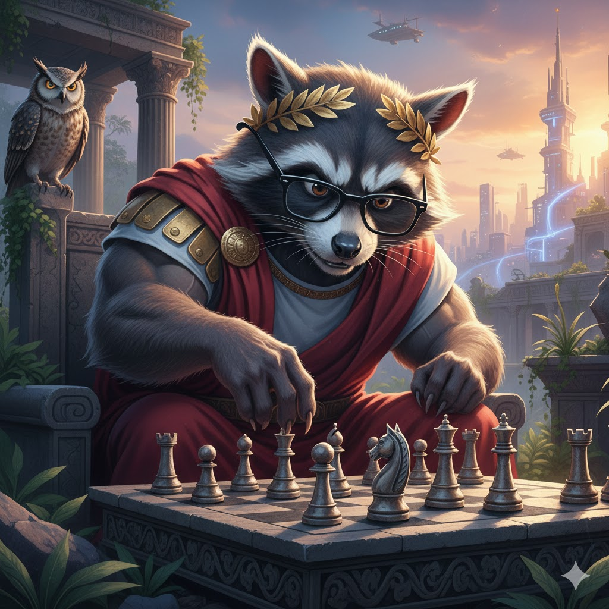
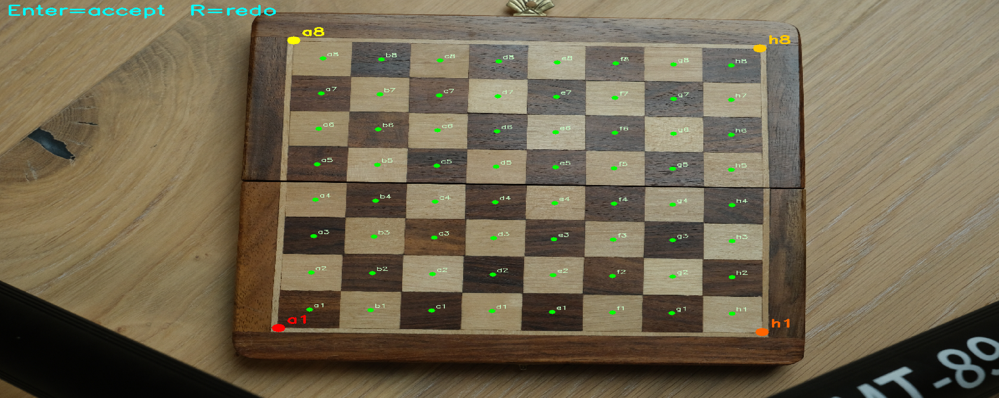
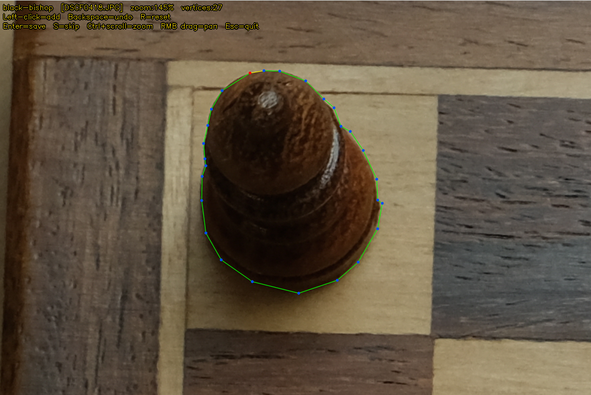
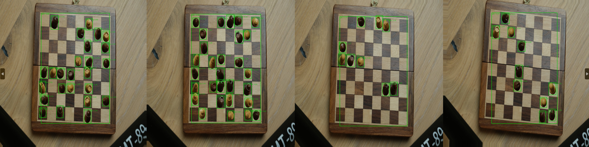
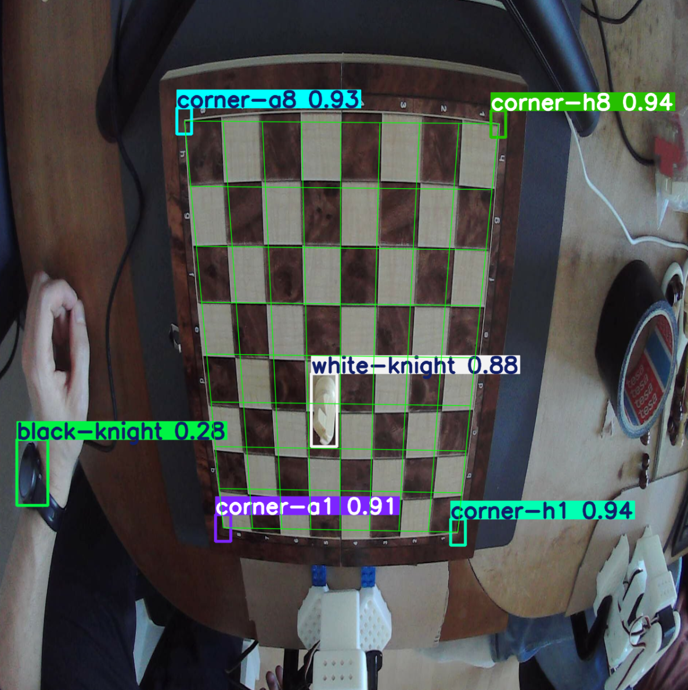

VENI VIDI VICI or so I have been told.


# Chess Perception AI — Training Pipeline

Train a YOLOv8 object detector to locate and classify all 12 chess piece types
in photos of a real physical chess board.

---

## Quick-start

```bash
pip install -r requirements.txt
```

Then follow the four steps below in order.

---

## Step 1 — Collect photos

**Empty board** (~5 photos, any angle/lighting):
```
real_data/chessboard_one/empty/
```

**Per-piece photos** — for each of the 12 piece types, take **5 photos** of that single piece placed at different positions on the board: one in each corner square (a1, a8, h1, h8) and one in a central square (e.g. d4). This captures the perspective distortion that varies across the board.

```
real_data/chessboard_one/pieces/
├── white-pawn/     ← 5 photos of the white pawn
├── white-rook/     ← 5 photos of the white rook
├── white-knight/
│   …
└── black-king/     ← 5 photos of the black king
```

Any JPG or PNG works. Folder names may use hyphens or underscores (`white_pawn` and `white-pawn` are both accepted).

---

## Step 2a — Annotate board squares


```bash
python scripts/annotate_fields.py --board chessboard_one
```

An OpenCV window opens for each empty-board photo.

| Action | What it does |
|--------|-------------|
| Click (×4) | Mark corners in order: **a8 → h8 → h1 → a1** |
| **Enter** | Accept — saves 64 square centers via homography |
| **R** | Reset clicks for the current image |
| **Esc** | Quit |

**Output:**
- `representation_data/chessboard_one/board_corners.json`
- `representation_data/chessboard_one/field_centers.json`

---

## Step 2b — Annotate pieces

```bash
python scripts/annotate_pieces.py --board chessboard_one
```

The script iterates through every piece-type folder and every image inside it.
The piece type is read from the folder name — no menu needed.
An OpenCV window opens for each image; draw a polygon around the piece:

**Draw mode** (new image):


| Action | What it does |
|--------|-------------|
| **Left-click** | Add polygon vertex |
| **Backspace** | Remove the last vertex |
| **Enter** | Close polygon and save crop |
| **R** | Reset — clear all vertices |
| **S** | Skip this image (no save) |
| **Ctrl + scroll wheel** | Zoom in / out at the cursor position |
| **Right-click drag** | Pan the view |
| **Esc** | Quit (progress saved so far) |

**Review mode** (image already annotated — existing polygon shown in cyan):

| Action | What it does |
|--------|-------------|
| **Enter** or **S** | Keep existing annotation, move to next image |
| **X** | Delete this annotation and re-draw a new polygon |
| **Esc** | Quit |

The zoom/pan controls work the same in both modes.

The crop is the tight bounding box of the polygon, with pixels outside the polygon transparent (RGBA PNG). A polygon mask — rather than a circle — correctly handles perspective distortion that makes pieces appear non-circular at board corners.

**Output:**
- `representation_data/chessboard_one/pieces/<label>/piece_NNN.png` (RGBA, polygon-masked)
- `representation_data/chessboard_one/pieces/pieces.json`

---

## Step 3 — Generate synthetic training data


```bash
python scripts/augment.py --boards chessboard_one --n 2000
```

Pastes random piece crops onto empty board images. Each piece gets a random horizontal flip, XY jitter, scale variation, rotation, Gaussian blur, and affine skew. Each synthetic image also receives 4 small corner-locator boxes (`corner-a8` / `corner-h8` / `corner-h1` / `corner-a1`, IDs 12–15) derived from `board_corners.json`. Each box is centred on its board corner with a radius of ¼ square size.

### Demo mode

Preview the augmentation interactively before committing to a full run — no files are written:

```bash
python scripts/augment.py --demo --boards chessboard_one
```

An OpenCV window shows one synthetic image at a time with ground-truth boxes overlaid. The HUD displays the active augmentation parameters. Press **Enter** for the next sample, **Esc** to quit.

### All flags

| Flag | Default | Description |
|------|---------|-------------|
| `--boards` | `chessboard_one` | One or more board names |
| `--n` | `2000` | Total images to generate |
| `--val-split` | `0.1` | Fraction held out for validation |
| `--min-pieces` | `1` | Min pieces per image |
| `--max-pieces` | `32` | Max pieces per image |
| `--seed` | `42` | RNG seed for reproducibility |
| `--clear` | off | Delete existing dataset before generating |
| `--jitter` | `0.15` | Max XY offset as fraction of square size |
| `--flip-prob` | `0.50` | Probability of horizontally flipping each piece |
| `--scale-var` | `0.0` | Scale drawn from U[1−k, 1+k] × base scale |
| `--rot-deg` | `5` | Rotation drawn from U[−k, k] degrees |
| `--board-rot-deg` | `3` | Max board rotation, U[−k, k] degrees |
| `--board-jitter` | `0.02` | Max board XY shift as fraction of image size |
| `--blur-max` | `1.0` | Max Gaussian blur radius (px) per piece crop (0 = off) |
| `--skew-max` | `0.08` | Max affine shear magnitude as fraction of crop size (0 = off) |
| `--demo` | off | Preview mode — no files written |
| `--boxes` | off | Show YOLO-format boxes in demo view |

**Output:**
- `dataset/images/{train,val}/synth_NNNNN.jpg`
- `dataset/labels/{train,val}/synth_NNNNN.txt` (YOLO format)
- `dataset/data.yaml`

---

## Step 4 — Train



Generates synthetic images on-the-fly during training — nothing is written to disk. Every epoch the model sees a fresh random set of images; the validation set uses a fixed seed so metrics are comparable across epochs.

```bash
python scripts/train.py --boards chessboard_one
```

### Visual validation

After each (or every N-th) epoch the script generates synthetic images, runs inference with the latest weights, and saves a 4×4 grid to `validation/epoch_NNNN.jpg`.

Each predicted box is colour-coded by comparing it to the ground-truth labels generated alongside the image:

| Colour | Meaning |
|--------|---------|
| **Green** | Correct — predicted box overlaps a GT box (IoU ≥ 0.3) and the class is right |
| **Blue** | Right position, wrong class — IoU ≥ 0.3 but class ID does not match |
| **Red** (thick) | False positive — predicted box with no GT box nearby (IoU < 0.3) |
| **Red** (thin) | False negative — GT box the model produced no prediction for |

Each predicted box is labelled with the predicted class name and confidence score. Unmatched GT boxes (thin red) carry no label.

```
validation/
├── epoch_0001.jpg
├── epoch_0002.jpg
└── …
```

### All flags

| Flag | Default | Description |
|------|---------|-------------|
| `--model` | `yolov8s` | `yolov8n` / `yolov8s` / `yolov8m` / `yolov8l` / `yolov8x` |
| `--epochs` | `1000000` | Max epochs — early stopping (patience) decides when to quit |
| `--imgsz` | `1280` | Input image size |
| `--batch` | `16` | Batch size (`-1` for auto). 16 is safe for 1280 px on 12 GB VRAM. |
| `--workers` | `0` | DataLoader worker threads (0 = main process, safest on Windows) |
| `--device` | auto | `0`, `0,1`, `cpu`, etc. |
| `--patience` | `1000` | Early-stopping patience |
| `--name` | `chess` | Run name inside `runs/detect/` |
| `--resume` | off | Resume interrupted training from `last.pt` |
| `--resume-best` | off | Fine-tune from `best.pt` of the current `--name` run |
| `--boards` | `chessboard_one` | Board names in `representation_data/` |
| `--n-per-epoch` | `128` | Synthetic images generated per epoch |
| `--val-images` | `4` | Images in the per-epoch validation grid |
| `--val-every` | `5` | Save validation grid every N epochs |
| `--label-mode` | `combined` | Class space: `combined` (16 classes), `color` (3), `type` (7) |

### Output files

Ultralytics plots and CSVs (`results.png`, `results.csv`, `train_batch*.jpg`, etc.) are suppressed — only weights are written:

```
runs/detect/chess/
├── weights/
│   ├── best.pt          ← best checkpoint (updated whenever val loss improves)
│   ├── last.pt          ← end of most recent epoch
│   ├── epoch10.pt       ← periodic checkpoint
│   ├── epoch20.pt
│   └── …
└── args.yaml            ← hyperparameters logged by Ultralytics
```

Periodic weights are saved every 10 epochs (`epoch10.pt`, `epoch20.pt`, …). Use them to roll back to an earlier checkpoint if the model overfits.

---

## Class definitions

| ID | Label | ID | Label |
|----|-------|----|-------|
| 0 | white-pawn | 6 | black-pawn |
| 1 | white-rook | 7 | black-rook |
| 2 | white-knight | 8 | black-knight |
| 3 | white-bishop | 9 | black-bishop |
| 4 | white-queen | 10 | black-queen |
| 5 | white-king | 11 | black-king |
| 12 | corner-a8 | 13 | corner-h8 |
| 14 | corner-h1 | 15 | corner-a1 |

The four `corner-*` classes are small boxes (radius ≈ ¼ square) centred on each outer board corner, generated automatically from `board_corners.json`. They give the model 4 discriminative anchor points so that `chessnotation.py` can compute an exact perspective-correct inverse homography from image space to board space.

---

## Model output — prediction format

### Running inference on a new image




```python
from ultralytics import YOLO

model = YOLO("runs/detect/chess/weights/best.pt")
results = model.predict("path/to/photo.jpg", imgsz=1280, conf=0.25)
```

### What `results` contains

`results` is a list with one `Results` object per input image.

```python
r = results[0]

r.boxes.xyxy    # shape (N, 4) – absolute pixel coords [x1, y1, x2, y2]
r.boxes.xywh    # shape (N, 4) – absolute [cx, cy, w, h]
r.boxes.xyxyn   # shape (N, 4) – normalised [0, 1] xyxy
r.boxes.xywhn   # shape (N, 4) – normalised [0, 1] xywh
r.boxes.conf    # shape (N,)   – confidence score per detection [0, 1]
r.boxes.cls     # shape (N,)   – integer class ID per detection
```

All tensors are on the same device as the model (CPU by default). Call `.cpu().numpy()` to get NumPy arrays.

### Iterating over individual detections

The model detects two kinds of object: **pieces** (IDs 0–11) and **corner locators** (IDs 12–15). Both appear in `r.boxes` — filter by class ID to separate them.

```python
CLASS_NAMES = [
    "white-pawn", "white-rook", "white-knight", "white-bishop",
    "white-queen", "white-king",       # IDs 0–5
    "black-pawn", "black-rook", "black-knight", "black-bishop",
    "black-queen", "black-king",       # IDs 6–11
    "corner-a8", "corner-h8",          # IDs 12–13
    "corner-h1", "corner-a1",          # IDs 14–15
]

for box in r.boxes:
    x1, y1, x2, y2 = box.xyxy[0].tolist()   # pixels, top-left / bottom-right
    conf  = float(box.conf[0])               # e.g. 0.87
    cls   = int(box.cls[0])                  # e.g. 5
    label = CLASS_NAMES[cls]                 # e.g. "white-king"
    print(f"{label:15s}  conf={conf:.2f}  box=({x1:.0f},{y1:.0f},{x2:.0f},{y2:.0f})")
```

### Board localisation (corner locators)

The four `corner-*` boxes mark the outer corners of the board (a8, h8, h1, a1). Their centres are passed to `cv2.getPerspectiveTransform` to compute an inverse homography from image space to 8×8 board space — this correctly handles perspective distortion for pieces near the narrow edges of a trapezoidal board.

**Separating pieces from corner locators:**

```python
CORNER_IDS = {12, 13, 14, 15}

pieces  = [box for box in r.boxes if int(box.cls[0]) not in CORNER_IDS]
corners = [box for box in r.boxes if int(box.cls[0]) in CORNER_IDS]
```

See `scripts/chessnotation.py` for the complete implementation, including a diagonal AABB fallback when fewer than 4 corners are detected.

### Bounding box coordinate system

```
(0,0) ─────────────────────── x →
  │
  │   ┌──────────┐
  │   │(x1, y1)  │
  │   │          │   ← axis-aligned rectangle in pixel space
  │   │  (x2,y2) │
  │   └──────────┘
  y ↓
```

- `x1, y1` — top-left corner (pixels from image top-left)
- `x2, y2` — bottom-right corner
- `cx = (x1+x2)/2`, `cy = (y1+y2)/2` — centre
- `w = x2-x1`, `h = y2-y1` — width and height
- Normalised variants divide by image width/height respectively

### Confidence threshold

The default `conf=0.25` keeps detections whose confidence ≥ 0.25.  Raise it (e.g. `conf=0.5`) to reduce false positives; lower it to catch harder cases. Adjust with:

```python
results = model.predict(..., conf=0.5)
# or filter after the fact:
mask = r.boxes.conf >= 0.5
high_conf_boxes = r.boxes.xyxy[mask]
```

### NMS (non-maximum suppression)

YOLOv8 applies NMS automatically before returning results. The `iou` parameter controls the overlap threshold (default `0.7`):

```python
results = model.predict(..., iou=0.5)  # stricter NMS → fewer overlapping boxes
```

### Saving annotated images

```python
r.save("output_annotated.jpg")   # draws boxes + labels onto the image and saves
# or
annotated = r.plot()             # returns a BGR numpy array (H×W×3)
```

---

## Step 5 — Run inference

Generates synthetic images on-the-fly and runs the trained model on each one
in an infinite interactive loop.

```bash
python scripts/infer.py
python scripts/infer.py --boards chessboard_one --conf 0.3 --seed 42
python scripts/infer.py --weights runs/detect/chess/weights/best.pt
```

An OpenCV window opens for each image. Press **any key** to generate and show
the next image; press **Esc** to quit.

For each image, `chessnotation.py` maps detected piece centres to board squares via a perspective-correct inverse homography (or diagonal AABB fallback), and prints an ASCII board grid:

```
--- image 1 ---
  a b c d e f g h
8 . . . . . . . .
7 p p p . p p p p
6 . . . . . . . .
5 . . . p . . . .
4 . . . . P . . .
3 . . . . . . . .
2 P P P P . P P P
1 R N B Q K B N R

--- image 2: corners not detected ---
```

Upper-case = white piece, lower-case = black piece, `.` = empty square.

### All flags

| Flag | Default | Description |
|------|---------|-------------|
| `--boards` | `chessboard_one` | Board name(s) in `representation_data/` |
| `--weights` | auto | Path to `.pt` weights (defaults to most recent training run) |
| `--conf` | `0.25` | Confidence threshold |
| `--imgsz` | `1280` | Inference image size |
| `--seed` | `None` | Fixed seed for reproducible images (omit for random each run) |

---

## Resuming / fine-tuning

### Resume interrupted training

If a run was interrupted, continue from where it left off:

```bash
python scripts/train.py --boards chessboard_one --name chess --resume
```

This loads `runs/detect/chess/weights/last.pt` and continues for the remaining epochs.

### Fine-tune from best weights (`--resume-best`)

`--resume-best` loads `runs/detect/<name>/weights/best.pt` and starts a new training run. Use it when:

- You want to add a second board without discarding what the model already learned
- You want to continue improving a model after early stopping triggered

```bash
# Step 1 — train on the first board until convergence
python scripts/train.py --boards chessboard_one --name chess --epochs 100

# Step 2 — fine-tune with the second board, starting from the best checkpoint
python scripts/train.py --boards chessboard_one chessboard_two \
    --name chess --resume-best --epochs 50
```

The second run re-uses the same `runs/detect/chess/` directory (`--exist-ok` is always set) so weights, metrics, and validation grids are all in one place.

If no `best.pt` exists yet the script exits with a clear error message directing you to run a full training first.

---

## Adding a second board

```bash
# 1. Drop photos
#    real_data/chessboard_two/empty/         ← bare board photos
#    real_data/chessboard_two/pieces/<type>/ ← 5 photos per piece type

# 2. Annotate
python scripts/annotate_fields.py --board chessboard_two
python scripts/annotate_pieces.py --board chessboard_two

# 3. Train from scratch with both boards
python scripts/train.py --boards chessboard_one chessboard_two --name chess

# — or — fine-tune the existing model on both boards (faster, preserves prior learning)
python scripts/train.py --boards chessboard_one chessboard_two --name chess --resume-best
```

---

## Project layout

```
chessReID/
├── real_data/
│   └── chessboard_one/
│       ├── empty/              ← bare board photos (~5)
│       └── pieces/
│           ├── white-pawn/     ← 5 photos of white pawn (corners + centre)
│           ├── white-rook/
│           │   …
│           └── black-king/     ← 5 photos of black king
├── representation_data/
│   └── chessboard_one/
│       ├── board_corners.json
│       ├── field_centers.json
│       └── pieces/
│           ├── pieces.json
│           └── {piece_type}/   ← RGBA crop PNGs
├── dataset/                ← generated by augment.py, gitignored
├── scripts/
│   ├── annotate_fields.py
│   ├── annotate_pieces.py
│   ├── augment.py
│   ├── train.py
│   ├── infer.py
│   └── chessnotation.py
├── runs/                   ← YOLOv8 training output, gitignored
├── validation/             ← per-epoch prediction grids, gitignored
│   ├── epoch_0001.jpg
│   └── …
└── requirements.txt
```
